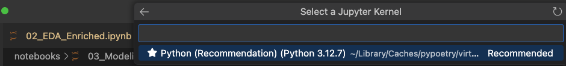

# Personalized Recommendation System

[](https://pre-commit.com/)
[](https://pytest-cov.readthedocs.io/)

[](https://codecov.io/gh/alexmatiasas/Personalized-Recommendation-System)


> **Objective**: Build a personalized movie recommendation system using enriched metadata from TMDb and collaborative user ratings from the MovieLens dataset. The goal is to demonstrate advanced skills in data ingestion, preprocessing, content-based modeling, hybrid systems, NoSQL data handling, and deployable ML pipelines—all suitable for real-world product integration and data science portfolios.

---

## 🔍 Project Overview

This project builds a movie recommender system by integrating collaborative filtering (MovieLens ratings) with content-based recommendations (using TMDb metadata). The enriched dataset is processed through Python and R workflows, and prepared for deployment using modern ML practices.

---

## 📁 Project Structure

    ```
    .
    ├── app/
    │   └── streamlit_app.py
    ├── data/
    │   ├── ml-1m/
    │   │   ├── movies.csv, ratings.csv, users.csv, etc.
    │   ├── processed/
    │   │   ├── enriched_movies_clean.csv, similarity_matrix.npy, etc.
    │   └── recommendations.db
    ├── docs/
    │   ├── enriched_data_analysis.md, jupyter_kernel_setup.md
    │   └── images/
    ├── models/
    │   └── user_similarity.joblib
    ├── notebooks/
    │   ├── 01_EDA_in_R.*, 02_EDA_Enriched.ipynb, etc.
    │   └── dev/
    ├── scripts/
    │   ├── init_db.sql, init_sqlite_db.py, load_data_to_db.py
    │   └── dev/
    │       ├── check_enriched_movies.py, convert_dat_to_csv.py, enrich_movies.py
    ├── src/
    │   ├── hybrid_recommendation.py
    │   ├── collaborative_filtering.py, content_based.py
    │   ├── db/
    │   │   ├── repository.py, sqlite_client.py
    │   ├── services/
    │   │   └── recommender_service.py
    │   ├── ui/
    │   │   ├── components.py, helpers.py, tmdb.py
    ├── tests/
    │   ├── test_collaborative_filtering.py, test_content_based.py
    ├── pyproject.toml, poetry.lock, requirements.txt
    ├── README.md, LICENSE, CONTRIBUTING.md, security_checklist.md
    ```

---

## 🚀 Tech Stack

### Data Acquisition & Enrichment

* Python (`pandas`, `requests`)
* TMDb API
* `dotenv`

### Modeling & Recommendation

* Content-based filtering (TF-IDF, cosine similarity)
* Collaborative filtering (Surprise)
* Hybrid systems

### Analysis & Visualization

* R (`ggplot2`, `dplyr`)
* Python (`matplotlib`, `seaborn`, `plotly`)
* Jupyter Notebooks

### Dev & Deployment

* Poetry (environment management)
* FastAPI or Streamlit (planned)
* Docker (optional)
* GitHub Actions (CI/CD – optional)

---

## 📦 Getting Started

    ```bash
    # Clone the repository
    $ git clone https://github.com/alexmatiasas/Personalized-Recommendation-System.git
    $ cd Personalized-Recommendation-System

    # Install Python dependencies
    $ poetry install

    # Set up environment variables
    $ cp .env.example .env
    # Add your TMDb API key and MongoDB URI in .env

    Your `.env` file should include the following keys if you plan to use poster enrichment or feedback logging:
        ```
        TMDB_API_KEY=your_tmdb_key_here
        MONGODB_URI=your_mongodb_uri_here
        ```
    If you're only running the app locally with SQLite and no feedback logging, you may omit these variables.
    ```

---

## 📊 EDA & Preprocessing

* MovieLens ratings explored in R
* Movie metadata enriched from TMDb (title, genres, overview, popularity, vote average)
* Exported dataset with 3755 enriched movies
* The file `enriched_movies_clean.csv` is not included in this repository. Instead, the preprocessed data has been loaded into the `data/recommendations.db` SQLite database, which powers the Streamlit app. You can regenerate the enrichment and populate the database using the scripts provided.

---

## 📁 Dataset Reproducibility

This project uses the MovieLens 1M dataset, enhanced via the TMDb API. To reproduce the enriched dataset locally:

1. Download the dataset from [MovieLens 1M](https://grouplens.org/datasets/movielens/1m/) and place the `.dat` files inside `data/ml-1m/`
2. Convert the `.dat` files to `.csv` using:
        ```bash
        poetry run python scripts/dev/convert_dat_to_csv.py
        ```
3. Enrich movie metadata using the TMDb API:
        ```bash
        poetry run python scripts/dev/enrich_movies.py
        ```
4. This creates `data/processed/enriched_movies_clean.csv`, used by the recommendation models and the Streamlit app.


Note: As of the latest version, the similarity matrices (`user_item_matrix.npz`, `similarity_matrix.npy`, and `user_similarity.joblib`) are no longer tracked in the repository. These files are automatically generated at runtime in the `data/processed/` and `models/` directories. If any matrix is missing, it will be computed on application startup. This ensures reproducibility and eliminates the need for storing large files.

Note: The enriched metadata includes additional fields such as movie poster, popularity, overview length, and release year, which are not present in the original MovieLens data.

---

## 📓 Jupyter Kernel Setup

To run the notebooks in the correct environment, install the Jupyter kernel as a development-only dependency:

    # Install Jupyter and IPython kernel for notebook development (dev group)
    poetry add --group dev ipykernel jupyter

    # Register the kernel
    poetry run python -m ipykernel install --user --name personalized-recommender --display-name    "Python (Recommendation)"

Then launch Jupyter:

    ```bash
    poetry run jupyter lab
    ```

In the notebook interface, go to `Select Kernel` and then `Jupyter Kernel...`.


and then select: Python (Recommendation) as the kernel.



📓 Full setup instructions: [docs/jupyter_kernel_setup.md](docs/jupyter_kernel_setup.md)

---

## 📊 Enriched Dataset EDA (02_EDA_Enriched.ipynb)

This notebook performs an exploratory analysis over the 3,755 enriched movies, focusing on:

* Overview length distributions
* Genre frequency
* Popularity and vote averages
* Release year patterns
* Top movies by rating and popularity

🖼️ Sample visualizations:

| Overview Length Distribution | Genre Frequency |
|-----------------------------|-----------------|
|  |  |

📊 Full EDA: [docs/enriched_data_analysis.md](docs/enriched_data_analysis.md)

---

## 🔍 Recommender Models

* ✅ Content-based recommender using TF-IDF over overviews and genres
* ✅ Collaborative filtering based on user-user similarity (CSR matrix + cosine similarity)
* ✅ SQLite-based backend for movie and rating queries
* ✅ Feedback logging to MongoDB with method, user ID, source movie and recommended movies
* ✅ Streamlit web app interface with dynamic posters, placeholders, and dual-mode recommendation
* 🧪 Hybrid model and Surprise SVD integration planned (see placeholder notebook)

---

## 📈 Deployment

* Streamlit app available via `app/streamlit_app.py`
* Interactive movie recommender with dual modes:
  * Content-based recommendations based on a selected movie
  * Collaborative filtering based on existing user preferences
* App connects to a local SQLite database (`data/recommendations.db`) for movie and rating queries. The similarity matrices are automatically generated if missing, so you do not need to precompute them.
  These matrices include the user-item matrix (`user_item_matrix.npz`), content-based similarity matrix (`similarity_matrix.npy`), and user-user similarity model (`user_similarity.joblib`). If any of these files are missing, the system will detect this at startup and regenerate them dynamically to ensure functionality.
* Feedback logs are recorded to MongoDB (if configured), including method, user id, movie titles, and timestamp
* Placeholder posters are used when actual TMDb images are missing

To launch the app locally:

    ```bash
    poetry run streamlit run app/streamlit_app.py
    ```

---

## 🔐 Security

See [security\_checklist.md](./security_checklist.md) for full practices.

* All secrets stored in `.env`
* `.env` excluded from Git
* TMDb keys and Mongo credentials never exposed
* MongoDB access limited to authenticated users (dev/prod separation planned)

---

## 🚧 Roadmap / Future Work

While the current version of this system implements content-based filtering and collaborative filtering (with optional real-time feedback logging to MongoDB), further enhancements are planned:

* 🗄️ MongoDB Atlas: Migration to MongoDB as a primary backend is planned for future versions.

* 🧠 Integrate matrix factorization models (e.g., `SVD` from the `surprise` library) for improved latent factor modeling.
* 🔄 Build a hybrid recommender that combines user-based and item-based strategies with content metadata.
* 🛠️ Add a retraining pipeline that leverages user feedback for model updates.
* 📊 Dashboard analytics: Analyze log data to show top recommended movies, engagement by method, and feedback patterns.
* 🔐 User authentication for personalized recommendation history.
* 🌐 Migrate to FastAPI backend for scalability and endpoint control (planned).
* 🚀 Containerize the app with Docker for production deployment.
* 📦 Migrate SQLite database to PostgreSQL for production-ready deployment and scalability

For advanced model experimentation, benchmarking, explainability (e.g., SHAP), and CI/CD deployment with FastAPI and Airflow, please refer to the [Fraud Detection project](https://github.com/alexmatiasas/Fraud-Detection-ML) in this portfolio.

---

## 🧠 Author

**Manuel Alejandro Matías Astorga**
PhD in Physics | Data Scientist | Machine Learning Engineer
[Portfolio](https://alexmatiasas.github.io) | [GitHub](https://github.com/alexmatiasas)

---

## 📄 License

MIT License — see the LICENSE file for details.
