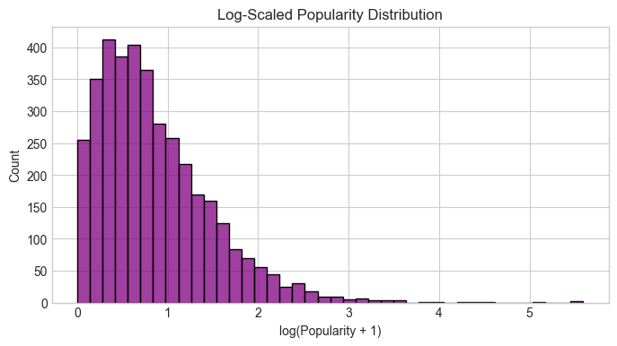

# 📊 Enriched Movie Data - Exploratory Analysis

This document summarizes the main findings from the exploratory analysis of the enriched MovieLens dataset, containing metadata from TMDb for **3,755** films. The goal is to understand the structure and quality of the data before modeling recommendations.

---

## 🔹 Dataset Overview

* **Source**: MovieLens 1M (`movies.dat`) enriched via the TMDb API
* **Total movies enriched**: 3,755
* **Stored in**: MongoDB Atlas (`movies_enriched` collection)
* **Features analyzed**:

  * `overview` (text)
  * `genres` (list)
  * `popularity` (float)
  * `vote_average` (float)
  * `release_date` (datetime)

---

## 📈 Feature Distributions

### ✍️ 4.1 Overview Length Distribution

The distribution of movie description lengths shows:

* Most overviews are between **100–400 characters**
* A small number exceed 800 characters
* Useful for TF-IDF or transformer-based embeddings

---

### 🎭 4.2 Genre Frequency

* The dataset includes a wide variety of genres
* Dominant ones: **Drama**, **Comedy**, **Action**
* Many movies belong to multiple genres

---

### 🧠 4.3 Rating Distribution

* Vote averages follow a **bell-shaped distribution**
* Most ratings lie between **5.5 and 7.5**
* Very few extreme ratings (e.g., near 0 or 10)

---

### 📉 4.4 Popularity Score Distribution

The `popularity` metric is not bounded and includes signals such as search trends, clicks, and social interactions.

* Highly **right-skewed** distribution
* Most movies have low popularity
* A few dominate due to virality or franchise power

To improve interpretability:

#### 🔍 Log-Scaled Popularity

* Helps visualize the long tail more clearly
* Can inform log-transform preprocessing before modeling

---

### 📅 4.5 Movies Released per Year

* Most movies are clustered between **1990 and 2010**
* Drop-off post-2010 suggests dataset sparsity, not lower production
* Suggests potential **temporal bias**

#### 🕰️ Grouped by Decade

* Smooths out visual clutter
* Highlights long-term trends (e.g., massive spike in 1990s)

---

## 🏆 4.6 Top Titles by Rating & Popularity

### 🎖️ Top Rated Movies (Vote Average)

These movies all received the maximum rating of 10.0:

* *The Princess Mononoke (1997)*
* *Abre los ojos (1997)*
* *The Three Ages (1923)*
* *The Rock (1996)*
* *Blood & Wine (1997)*

### 🔥 Top Popular Movies (Engagement Score)

Top movies based on TMDb's popularity metric:

* *Mission: Impossible (1996)* — 267.74
* *The Mission (1986)* — 267.74
* *The Wood (1999)* — 173.66
* *Final Destination (2000)* — 89.14
* *The Lion King (1994)* — 84.03

---

## 📂 Summary & Next Steps

* Feature distributions show strong skew in popularity, normality in ratings, and diverse genre coverage
* Visualizations highlight dataset bias (e.g., temporal concentration, description length)
* Dataset is now cleaned, structured, and saved as `enriched_movies_clean.csv`
* Ready for: **Content-based filtering** and **TF-IDF based similarity modeling**

Next step: `03_Content_Recommender.ipynb`

> 📁 All visuals used in this analysis are stored in `/docs/images/`
