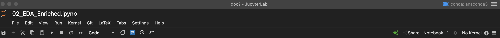
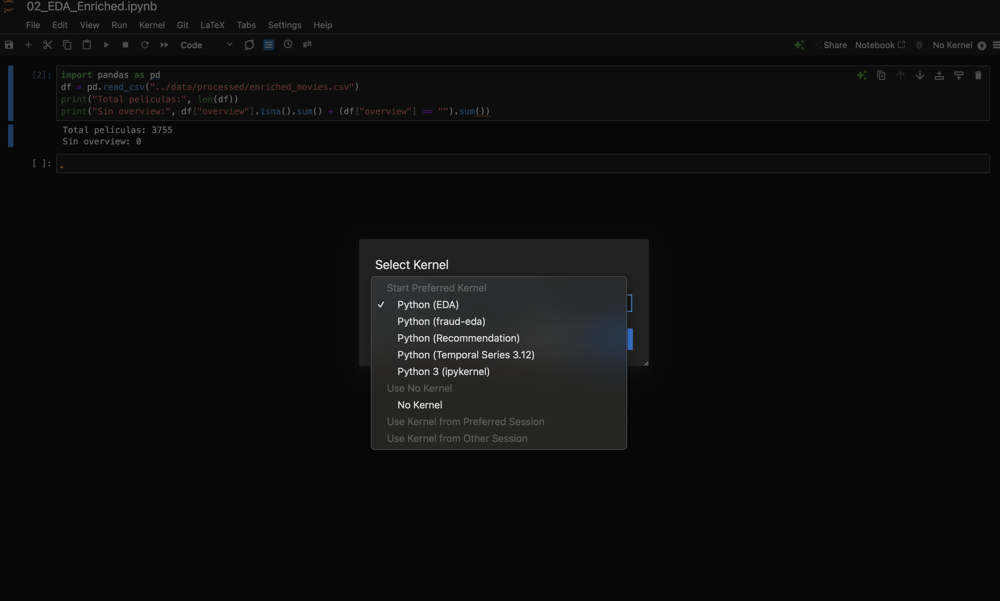

# 🧢 Jupyter Kernel Setup

This document explains how to configure the Poetry-managed virtual environment as a Jupyter kernel for running the notebooks in this project.

---

## 📦 Install Jupyter & Kernel

Install the necessary development dependencies using Poetry:

    ```bash
    poetry add --group dev ipykernel jupyter
    ```

These packages are grouped under `[tool.poetry.group.dev.dependencies]` in `pyproject.toml` to keep production dependencies clean.

---

## 🧠 Register the Kernel

After installing, register the virtual environment as a Jupyter kernel:

    ```bash
    poetry run python -m ipykernel install --user --name personalized-recommender --display-name "Python (Recommendation)"
    ```

* `--name` is the internal ID used by Jupyter
* `--display-name` is what you see in the Jupyter UI (e.g. notebook interface)

---

## 🚀 Launch Jupyter Lab

You can start Jupyter Lab or Notebook from within your Poetry environment:

    ```bash
    poetry run jupyter lab
    ```

Inside the notebook, click the kernel selector and choose:

> **Python (Recommendation)**

(as in the following images, select in No Kernel)





If you're using VS Code, you can do this through the Command Palette:

1. Select Kernel
    

2. Jupyter Kernel...
    

3. Python (Recommendation)
    

---

## 📄 Reference

* All dependencies are tracked in `pyproject.toml`
* Dev dependencies are isolated from production packages
* This setup guarantees full reproducibility of your notebook environment
